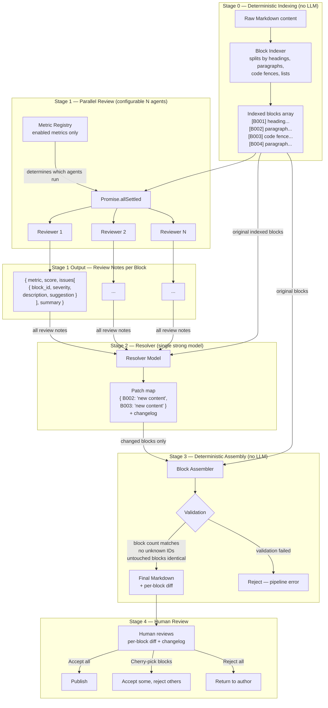
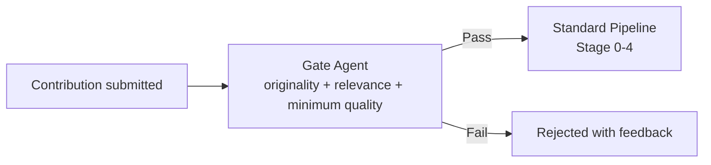

# Content Quality Pipeline

**Version:** 3.0.0
**Last updated:** 2026-02-20

## Overview

Automated content quality verification system powered by LLMs via OpenRouter. Content is **deterministically split into indexed blocks** before any LLM sees it. A configurable set of **Reviewer agents** evaluate blocks in parallel. A single **Resolver model** then outputs **only the block IDs it wants to change** with new content. Untouched blocks remain **byte-identical** — guaranteed by code, not by LLM behavior.

### Core Principle: LLMs Never See Raw Content

Every LLM in the pipeline receives **indexed blocks**, never raw Markdown. This makes every reference unambiguous and every assembly step deterministic.

```
Raw Markdown → [Deterministic Indexer] → Indexed Blocks → LLMs → Changed Block IDs → [Deterministic Assembler] → Result
```

## Architecture



## Stage 0 — Deterministic Block Indexing

Before any LLM is called, a **deterministic parser** (pure code, no AI) splits the Markdown into numbered blocks. This runs once and the result is used by all subsequent stages.

### Splitting Rules

The parser walks the Markdown line by line and splits on these boundaries:

| Boundary | Rule |
|----------|------|
| **Heading** | Any line starting with `#` starts a new block |
| **Code fence** | Opening ` ``` ` through closing ` ``` ` is one block (including fences) |
| **Blank line separation** | Consecutive non-blank lines form one paragraph block |
| **List** | A contiguous list (ordered or unordered) is one block |
| **Blockquote** | Contiguous `>` lines form one block |
| **Horizontal rule** | `---` / `***` is its own block |
| **Table** | Contiguous table rows (with `|`) form one block |

### Block Format

Each block gets a sequential ID: `B001`, `B002`, ..., `B{NNN}`.

```
[B001]
# React Hooks Guide

[B002]
React hooks let you use state and other React features in function components. They were introduced in React 16.8.

[B003]
## useReducer

[B004]
The useReducer hook accepts a reducer and returns the current state paired with a dispatch method.

[B005]
```javascript
const [state, dispatch] = useReducer(reducer, initialState);
```

[B006]
Firebase v9 modular SDK is the recommended approach.

[B007]
## Advanced Patterns

[B008]
React context combined with useReducer provides a Redux-like pattern without external dependencies. This section covers the full implementation including provider setup, typed dispatch, and performance optimization with useMemo.
```

### Properties

- **Deterministic** — same input always produces same blocks with same IDs
- **Lossless** — concatenating all blocks in order reproduces the original Markdown byte-for-byte (including blank lines between blocks)
- **Unique IDs** — no two blocks share an ID within a document
- **Self-contained** — each block is a meaningful unit (a heading, a paragraph, a code block, a list) — never a partial line

### Why Not Line Numbers?

Line numbers break when content has multi-line paragraphs, nested lists, or code blocks. A paragraph at lines 15-22 is one semantic unit — referring to "line 18" inside it is meaningless. Blocks match how humans and LLMs think about document structure.

## Configurable Metric Registry

Metrics are **not hardcoded**. They live in a configuration that can be modified without code changes. Start with 2, add more as you validate the pipeline.

### Registry Schema

```json
{
  "metrics": [
    {
      "id": "weryfikacja_techniczna",
      "name": "Weryfikacja Techniczna",
      "description": "Are statements factually correct? Do code examples compile and behave as described?",
      "model": "anthropic/claude-opus-4",
      "enabled": true,
      "prompt_template": "technical_correctness.md"
    },
    {
      "id": "aktualnosc",
      "name": "Aktualność",
      "description": "Is the content up-to-date with current library versions, APIs, and standards?",
      "model": "anthropic/claude-sonnet-4",
      "enabled": true,
      "prompt_template": "currency.md"
    },
    {
      "id": "praktycznosc",
      "name": "Praktyczność",
      "description": "Are code examples tested, runnable, and solving real problems?",
      "model": "anthropic/claude-sonnet-4",
      "enabled": false,
      "prompt_template": "practicality.md"
    }
  ],
  "resolver": {
    "model": "anthropic/claude-opus-4"
  }
}
```

| Field | Description |
|-------|-------------|
| `id` | Unique key, lowercase, no diacritics |
| `name` | Display name |
| `description` | What this metric evaluates — also injected into the agent's system prompt |
| `model` | OpenRouter model identifier |
| `enabled` | `true` / `false` — toggle without removing config |
| `prompt_template` | Path to the prompt file for this metric |

### Suggested Rollout

| Phase | Active Metrics | Purpose |
|-------|---------------|---------|
| **Phase 1** | `weryfikacja_techniczna`, `aktualnosc` | Validate pipeline end-to-end with the two most impactful metrics |
| **Phase 2** | + `praktycznosc`, `przystepnosc` | Add content quality dimensions |
| **Phase 3** | + `kompletnosc`, `dostepnosc` | Structural completeness and formatting |
| **Phase 4** | + `feedback`, `aktualizacje` | Community-driven and maintenance metrics |

### Full Metric Catalog

| # | ID | Name | Suggested Model |
|---|-----|------|-----------------|
| 1 | `weryfikacja_techniczna` | Weryfikacja Techniczna (Technical Correctness) | `anthropic/claude-opus-4` |
| 2 | `aktualnosc` | Aktualność (Currency) | `anthropic/claude-sonnet-4` |
| 3 | `praktycznosc` | Praktyczność (Practicality) | `anthropic/claude-sonnet-4` |
| 4 | `przystepnosc` | Przystępność (Accessibility) | `anthropic/claude-haiku-4` |
| 5 | `kompletnosc` | Kompletność (Completeness) | `anthropic/claude-sonnet-4` |
| 6 | `dostepnosc` | Dostępność (Availability/Formatting) | `anthropic/claude-haiku-4` |
| 7 | `feedback` | Feedback (Community Responsiveness) | `anthropic/claude-haiku-4` |
| 8 | `aktualizacje` | Aktualizacje (Update Frequency) | `anthropic/claude-haiku-4` |

## Stage 1 — Parallel Metric Review

Only `enabled` metrics from the registry are executed. Each reviewer agent receives the **indexed blocks** (not raw Markdown) and its own prompt template. Agents produce **review notes referencing block IDs** — they never produce replacement content.

### Execution

```typescript
const enabledMetrics = registry.metrics.filter(m => m.enabled);

const reviews = await Promise.allSettled(
  enabledMetrics.map(metric => evaluateMetric(metric, indexedBlocks))
);

// Pipeline continues with successful reviews only.
// Failed metrics are logged and flagged in the final report.
```

### Reviewer Input

The reviewer sees blocks in this format:

```
You are reviewing the following content for: {metric.description}

Content blocks:

[B001]
# React Hooks Guide

[B002]
React hooks let you use state and other React features in function components. They were introduced in React 16.8.

[B003]
## useReducer

[B004]
The useReducer hook accepts a reducer and returns the current state paired with a dispatch method.

...
```

### Reviewer Output Schema

```json
{
  "metric": "weryfikacja_techniczna",
  "score": 82,
  "issues": [
    {
      "block_id": "B004",
      "severity": "critical",
      "description": "Incorrect — useReducer returns an array [state, dispatch], not 'paired with'. The phrasing implies an object.",
      "suggestion": "Clarify that useReducer returns a tuple: [state, dispatch]."
    },
    {
      "block_id": "B006",
      "severity": "warning",
      "description": "Firebase v9 has been superseded by v11. The statement is outdated.",
      "suggestion": "Update to reference Firebase v11 modular SDK."
    }
  ],
  "summary": "Two issues found: one factual inaccuracy in hooks description (B004), one outdated Firebase reference (B006)."
}
```

| Field | Type | Description |
|-------|------|-------------|
| `metric` | `string` | Metric ID from registry |
| `score` | `number` (0-100) | Numerical score for this dimension |
| `issues` | `Issue[]` | Detected problems |
| `issues[].block_id` | `string` | **Which block** the issue is in — unambiguous reference |
| `issues[].severity` | `"critical" \| "warning" \| "info"` | Urgency level |
| `issues[].description` | `string` | What is wrong |
| `issues[].suggestion` | `string` | Human-readable advice (not replacement text) |
| `summary` | `string` | One-sentence overview |

**Why `block_id` works where `quote` and `location` failed:**
- A block ID is a **closed set** — the validator can check if `B004` actually exists. If the LLM references `B999`, it's immediately caught.
- No ambiguity — `B004` is exactly one block. A quote like `"useReducer returns"` could match multiple places.
- No structural path guessing — `section:X > paragraph:3` requires the LLM to count correctly. Block IDs are given to it explicitly.

## Stage 2 — Resolver

A single strong model (`anthropic/claude-opus-4`) receives:
1. The **indexed blocks** (full document in `[B001]...[B00N]` format)
2. All **reviewer outputs** (the structured JSON from Stage 1)

It produces a **patch map** — only the blocks it wants to change — plus a changelog.

### Resolver Prompt Structure

```
You are a content editor. Below is an article split into indexed blocks, followed by review notes from multiple reviewers.

Your task:
1. Read all review notes carefully.
2. For each block that needs changes, output the COMPLETE new content for that block.
3. Do NOT output blocks that don't need changes.
4. If two reviewers disagree about a block, make a judgment call and explain in the changelog.
5. Never merge blocks, split blocks, add new blocks, or remove blocks. The block structure is fixed.

IMPORTANT CONSTRAINTS:
- You may ONLY change the content within existing blocks.
- You MUST keep the same number of blocks.
- You MUST NOT reference block IDs that don't exist in the original.
- Each changed block must contain the FULL replacement content for that block.

Content blocks:

[B001]
# React Hooks Guide

[B002]
React hooks let you use state and...

...

Review notes:

[weryfikacja_techniczna] score: 82
- B004 (critical): Incorrect — useReducer returns an array...
- B006 (warning): Firebase v9 has been superseded...

[aktualnosc] score: 88
- B006 (critical): Firebase v9 is EOL since 2024...
```

### Resolver Output Schema

```json
{
  "patches": {
    "B004": "The useReducer hook accepts a reducer function and an initial state value. It returns a tuple — an array of exactly two elements: the current state and a dispatch function.",
    "B006": "Firebase v11 modular SDK is the recommended approach. It was released in 2025 and includes tree-shaking support and improved TypeScript types."
  },
  "changelog": [
    {
      "block_id": "B004",
      "what": "Fixed useReducer return type description",
      "why": "Original stated 'paired with' implying an object. useReducer returns a [state, dispatch] tuple.",
      "triggered_by": ["weryfikacja_techniczna"],
      "severity": "critical"
    },
    {
      "block_id": "B006",
      "what": "Updated Firebase version from v9 to v11",
      "why": "Firebase v9 is EOL. Both reviewers flagged this independently.",
      "triggered_by": ["weryfikacja_techniczna", "aktualnosc"],
      "severity": "critical"
    },
    {
      "block_id": null,
      "what": "No changes to React context section (B008)",
      "why": "Considered simplifying but the depth is appropriate for the target senior audience.",
      "triggered_by": [],
      "severity": "info"
    }
  ],
  "scores": {
    "weryfikacja_techniczna": 82,
    "aktualnosc": 88
  },
  "average_score": 85.0,
  "missing_metrics": []
}
```

**Key design: `patches` is a map of `block_id → new content`.** Only changed blocks appear. The Resolver cannot add, remove, or reorder blocks — that constraint is enforced by code in Stage 3.

## Stage 3 — Deterministic Assembly & Validation

Pure code. No LLM. Takes the original indexed blocks + the patch map and produces the final document.

### Algorithm

```typescript
function assemble(
  originalBlocks: Map<string, string>,
  patches: Record<string, string>
): AssemblyResult {
  const errors: string[] = [];

  // Validation 1: All patch IDs must exist in original
  for (const blockId of Object.keys(patches)) {
    if (!originalBlocks.has(blockId)) {
      errors.push(`Patch references unknown block: ${blockId}`);
    }
  }

  if (errors.length > 0) {
    return { success: false, errors };
  }

  // Assembly: walk original blocks in order, apply patches
  const finalBlocks: string[] = [];
  const diff: BlockDiff[] = [];

  for (const [blockId, originalContent] of originalBlocks) {
    if (blockId in patches) {
      finalBlocks.push(patches[blockId]);
      diff.push({
        block_id: blockId,
        status: "changed",
        original: originalContent,
        revised: patches[blockId],
      });
    } else {
      // Untouched — byte-identical, guaranteed
      finalBlocks.push(originalContent);
      diff.push({
        block_id: blockId,
        status: "unchanged",
      });
    }
  }

  // Validation 2: Block count unchanged
  if (finalBlocks.length !== originalBlocks.size) {
    return { success: false, errors: ["Block count mismatch"] };
  }

  return {
    success: true,
    markdown: joinBlocks(finalBlocks),
    diff,
    stats: {
      total_blocks: originalBlocks.size,
      changed_blocks: Object.keys(patches).length,
      unchanged_blocks: originalBlocks.size - Object.keys(patches).length,
    },
  };
}
```

### Guarantees

| Property | How it's enforced |
|----------|-------------------|
| **Untouched blocks are byte-identical** | Code copies original content directly — LLM never touches them |
| **No blocks added** | Assembly iterates original block list only |
| **No blocks removed** | Every original block appears in output |
| **No block reordering** | Assembly preserves original iteration order |
| **No unknown block IDs** | Validation rejects patches referencing non-existent IDs |
| **No duplicates** | Patch map is a dict — keys are unique by definition |

### Per-Block Diff Output

For human review, each changed block produces a clear diff:

```
[B004] CHANGED (critical)
Triggered by: weryfikacja_techniczna
Reason: Fixed useReducer return type description

--- original
+++ revised
- The useReducer hook accepts a reducer and returns the current state paired with a dispatch method.
+ The useReducer hook accepts a reducer function and an initial state value. It returns a tuple — an array of exactly two elements: the current state and a dispatch function.

[B006] CHANGED (critical)
Triggered by: weryfikacja_techniczna, aktualnosc
Reason: Updated Firebase version from v9 to v11

--- original
+++ revised
- Firebase v9 modular SDK is the recommended approach.
+ Firebase v11 modular SDK is the recommended approach. It was released in 2025 and includes tree-shaking support and improved TypeScript types.

[B001] unchanged
[B002] unchanged
[B003] unchanged
[B005] unchanged
[B007] unchanged
[B008] unchanged
```

## Stage 4 — Human Review

The reviewer sees:
1. **Scores** — per-metric and average
2. **Changelog** — what changed and why, in plain language
3. **Per-block diff** — exact before/after for each changed block

Options:
- **Accept all** — publish the assembled version
- **Cherry-pick** — accept/reject individual block patches (the assembler re-runs with only accepted patches)
- **Reject all** — discard, return changelog to author as feedback

Cherry-picking is trivial: just remove rejected block IDs from the patch map and re-run assembly. No cascading side effects because blocks are independent.

## OpenRouter Integration

All LLM calls go through OpenRouter (`https://openrouter.ai/api/v1`).

### Request Pattern

```
POST /api/v1/chat/completions
Authorization: Bearer $OPENROUTER_API_KEY
Content-Type: application/json

{
  "model": "anthropic/claude-sonnet-4",
  "messages": [...],
  "response_format": { "type": "json_schema", "json_schema": { ... } }
}
```

### Parallel Execution

```typescript
const results = await Promise.allSettled(
  enabledMetrics.map(metric =>
    fetch("https://openrouter.ai/api/v1/chat/completions", {
      method: "POST",
      headers: {
        "Authorization": `Bearer ${OPENROUTER_API_KEY}`,
        "Content-Type": "application/json",
      },
      body: JSON.stringify({
        model: metric.model,
        messages: buildReviewerPrompt(metric, indexedBlocks),
        response_format: { type: "json_schema", json_schema: reviewerSchema },
      }),
    })
  )
);
```

### Estimated Cost per Article

#### Phase 1 (2 metrics)

| Stage | Model | Est. tokens (in/out) | Est. cost |
|-------|-------|----------------------|-----------|
| Technical Correctness | claude-opus-4 | ~6K/2K | $0.12 |
| Currency | claude-sonnet-4 | ~4K/2K | $0.03 |
| Resolver | claude-opus-4 | ~14K/4K | $0.30 |
| **Total** | | | **~$0.45/article** |

#### Phase 4 (all 8 metrics)

| Stage | Model | Est. tokens (in/out) | Est. cost |
|-------|-------|----------------------|-----------|
| 4x Haiku agents | claude-haiku-4 | ~4K/1K each | $0.01 |
| 3x Sonnet agents | claude-sonnet-4 | ~4K/2K each | $0.05 |
| 1x Opus agent | claude-opus-4 | ~6K/2K | $0.12 |
| Resolver (Opus) | claude-opus-4 | ~24K/6K | $0.48 |
| **Total** | | | **~$0.66/article** |

## Contribution Pipeline

External contributions follow the identical pipeline. An additional **Gate Agent** (Haiku) runs before Stage 0:



## Re-evaluation Pipeline

Existing published content is periodically re-evaluated when:
- New comments/feedback are submitted on the content
- A configured time interval passes (e.g., 90 days)
- A technology mentioned in the content releases a new major version

The re-evaluation runs the same Stage 0-4 pipeline with user comments appended as additional context to each reviewer's prompt.

## Scoring Scale

| Range | Label | Action |
|-------|-------|--------|
| 90-100 | Excellent | No action needed |
| 80-89 | High quality | Minor improvements suggested |
| 70-79 | Good quality | Updates planned |
| Below 70 | Needs update | Priority review triggered |

## Design Decision Log

### Why indexed blocks instead of full rewrite? (v2 → v3)

v2 let the Resolver rewrite the entire document and used a diff tool to find changes. Problem: the LLM could silently drop paragraphs, duplicate sections, or subtly alter text it wasn't supposed to touch — and detecting these silent mutations in a large diff is hard for a human reviewer.

v3 constrains the LLM to output **only changed blocks by ID**. Untouched blocks are preserved by code, not by LLM discipline. The assembler validates that no blocks were added/removed/reordered. This makes unintended changes **structurally impossible**, not just unlikely.

### Why not line numbers?

Line numbers break with multi-line paragraphs, nested lists, and code blocks. Line 18 inside a 10-line paragraph is meaningless. Blocks match semantic document structure — a heading, a paragraph, a code fence — which is how both humans and LLMs reason about content.

### Why not surgical diffs from LLM? (v1 post-mortem)

v1 asked the Resolver to produce `replace`/`insert`/`delete` operations with exact text. This failed because: LLMs hallucinate locations, misquote originals, and sequential operations cascade (operation 1 shifts content for operation 2). The block-based approach eliminates all three problems.
